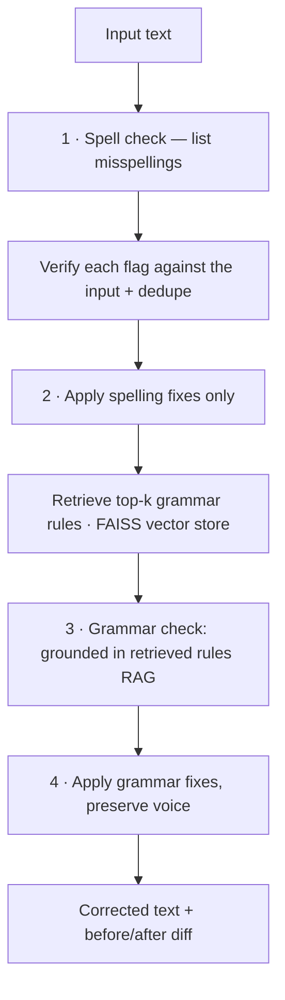

# ✍️ YourWords: an AI Grammar Assistant that maintains YOUR voice

[](https://yourwordsai.streamlit.app/)
&nbsp;


A retrieval-augmented writing assistant that corrects spelling and grammar while
preserving the author's voice. It grounds its grammar suggestions in a vector store
of real style rules (RAG) rather than relying on the model's memory alone, and
guards against the model inventing corrections that aren't in your text.

**[▶ Try the live demo](https://yourwordsai.streamlit.app/)** — paste a paragraph and see the corrected text, a before/after diff, and the rules the checker retrieved.

---

## What it does

Paste in a piece of writing and YourWords returns:

- a **corrected version** of the text, with the author's tone and word choice left intact;
- a **word-level before/after diff** showing exactly what changed;
- the **spelling** and **grammar** issues it found, each explained; and
- the **grammar rules it retrieved** to inform the check, so the reasoning is transparent, not a black box.

It's aimed at the failure modes that trip up generic "rewrite this" prompts: over-eager rewriting that erases voice, and confidently invented "corrections" that don't match the input.

## How it works

The core is a **four-stage agent pipeline**. Each stage is a single-purpose LLM call, so concerns stay isolated and one stage can't silently undo another:



A few design decisions worth calling out:

**Retrieval-augmented grammar checking.** Before the grammar stage runs, the text is embedded and matched against a FAISS index of grammar/style rules; the most relevant rules are injected into the grammar prompt. This grounds suggestions in an explicit, inspectable ruleset and the retrieved rules are surfaced in the UI so you can see what informed each check.

**Hallucination guards.** A language model asked to "list misspellings" will occasionally invent a word that isn't in the text. Every flagged misspelling is verified to actually appear in the input before it's shown or applied, and duplicates are collapsed. Retrieval failures degrade gracefully, and if the index is unavailable, the pipeline falls back to a plain grammar check instead of crashing.

**Determinism.** Generation runs at `temperature=0` so the same input yields the same output; important for a tool people are meant to trust and re-run.

**Model-agnostic backend.** The pipeline only ever calls `generate_response(messages)`. That function talks to any OpenAI-compatible endpoint, so switching inference providers or models is a config change, not a code change. It also handles a subtlety of hosted *reasoning* models (GPT-OSS): their hidden reasoning is billed against the token budget, so the backend requests low reasoning effort and treats an empty completion as an explicit error rather than a silent "no issues found."

## Tech stack

| Layer | Choice |
|---|---|
| UI | Streamlit |
| Orchestration | Custom 4-stage agent pipeline (Python) |
| Inference | Hosted Llama 3.x / GPT-OSS via an OpenAI-compatible API (Groq) |
| Retrieval | FAISS vector store + `sentence-transformers` (`all-MiniLM-L6-v2`) |
| Config | environment variables / Streamlit Secrets |

## Project structure

```
YourWords/
├── app.py                  # Streamlit UI (entry point)
├── pipeline.py             # 4-stage spelling + grammar pipeline
├── llm.py                  # hosted-LLM backend (provider-agnostic)
├── retriever.py            # FAISS grammar-rule retriever
├── build_vector_store.py   # builds the FAISS index from grammar_rules.json
├── grammar_rules.json      # the grammar/style ruleset (source of truth)
├── requirements.txt
└── .env.example
```

## Running locally

**Prerequisites:** Python 3.10+ and a free API key from an OpenAI-compatible provider (e.g. [Groq](https://console.groq.com/)).

```bash
git clone https://github.com/WalrusIII/YourWords.git
cd YourWords

pip install -r requirements.txt

cp .env.example .env        # then add your API key
python build_vector_store.py   # builds the FAISS index (first run downloads the embedding model)
streamlit run app.py
```

Your `.env`:

```env
LLM_API_KEY=your_api_key_here
LLM_BASE_URL=https://api.groq.com/openai/v1
LLM_MODEL=openai/gpt-oss-20b
```

## Deploying

The live version runs on **Streamlit Community Cloud**. To deploy your own:

1. Push the repo to GitHub.
2. Create a new app on Streamlit Community Cloud pointing at `app.py`.
3. Add `LLM_API_KEY` (and optionally `LLM_BASE_URL` / `LLM_MODEL`) under the app's **Secrets**.
4. Make sure the FAISS index is available in the deployed environment — either commit it, or build it on startup, since the app needs it for the retrieval stage.

> **Model note:** hosted model lineups change. If you get a `model_not_found` error, check your provider's current model list and update `LLM_MODEL`. GPT-OSS and other reasoning models are supported; the backend requests low reasoning effort so responses aren't lost to the reasoning budget.

